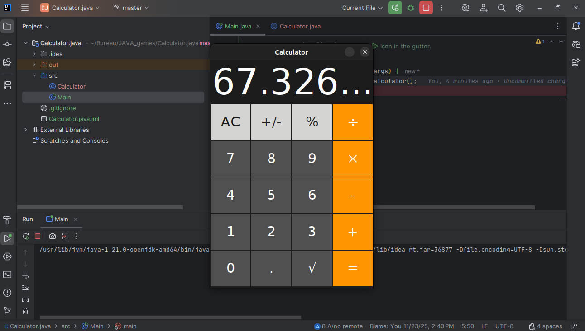

# 🧮 Calculator - Application de Calcul en Java

## Description du Projet

Ce projet est une implémentation d'une application de calculatrice de base (standard ou scientifique), développée en Java.

Les éléments clés de cette version incluent :
* Une interface utilisateur graphique (GUI) pour l'entrée des données.
* La gestion des opérations arithmétiques de base (+, -, *, /).
* La gestion de la précédence des opérateurs (si applicable).
* Le traitement des erreurs (division par zéro, etc.).

## Aperçu de l'Application

Voici une capture d'écran de l'interface de la calculatrice :

## 🛠️ Réalisé par

Ce projet a été développé par **Mariem Mhadhbi**.
