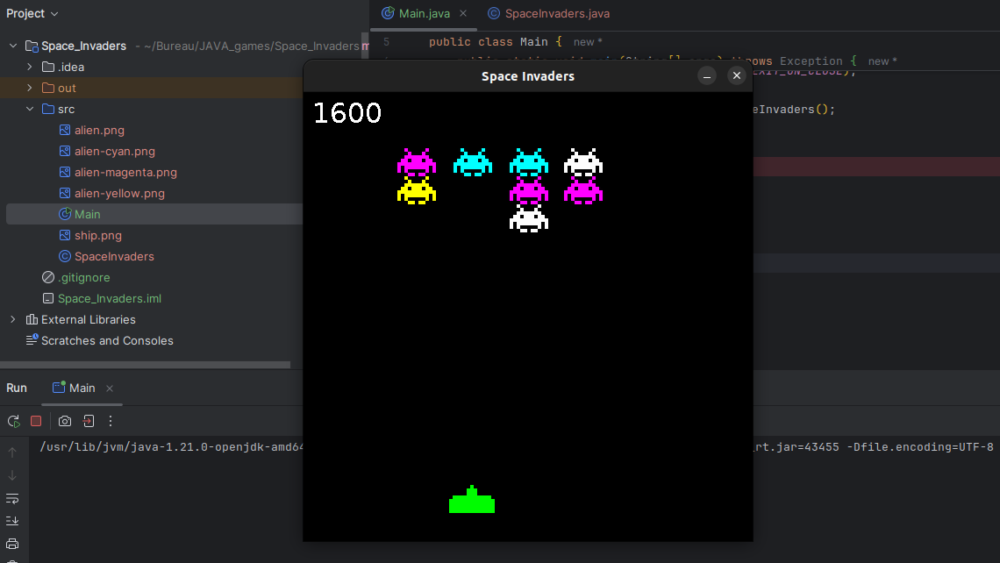

# 👾 Space Invaders - Le Classique de l'Arcade en Java

## Description du Projet

Ce projet est une réimplémentation du célèbre jeu d'arcade "Space Invaders", développé en Java.

Les éléments clés de cette version incluent :
* Le déplacement du vaisseau joueur.
* La gestion des vagues d'envahisseurs et de leur mouvement.
* Les mécanismes de tir et la détection des collisions.
* La gestion des boucliers (si implémentés).

## Aperçu du Jeu

Voici une capture d'écran de l'action en cours :

## 🛠️ Réalisé par

Ce projet a été développé par **Mariem Mhadhbi**.
