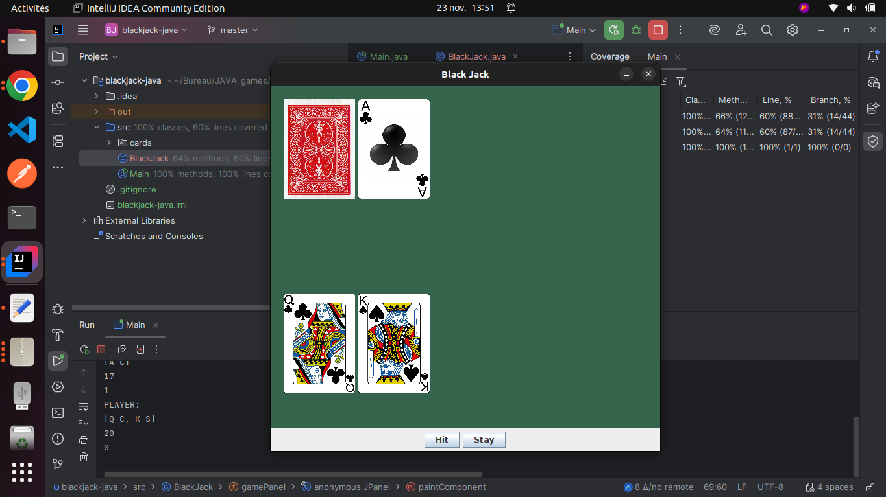

# ♦️ Blackjack (Vingt-et-un) - Jeu de Cartes en Java

## Description du Projet

Ce projet est une implémentation du célèbre jeu de cartes "Blackjack" (Vingt-et-un), développé en Java.

Les éléments clés de cette version incluent :
* La gestion des cartes, du paquet et de la pioche aléatoire.
* L'application des règles de base (tirer une carte, rester, double mise).
* Le suivi des scores du joueur et du croupier.
* La gestion des mises (si implémentées).

## Aperçu du Jeu

Voici une capture d'écran de l'interface du jeu :

## 🛠️ Réalisé par

Ce projet a été développé par **Mariem Mhadhbi**.
