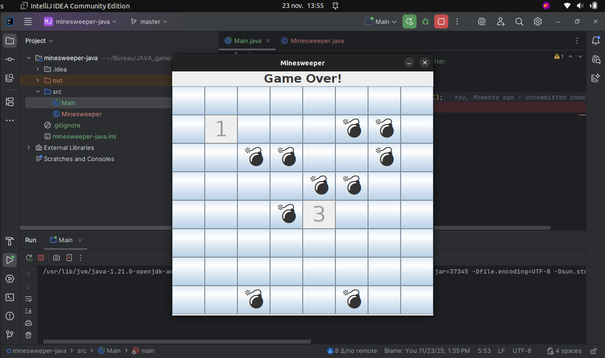

# 💣 Minesweeper (Démineur) - Jeu de Logique en Java

## Description du Projet

Ce projet est une implémentation du jeu de logique classique "Minesweeper" (Démineur), développé en Java.

Les éléments clés de cette version incluent :
* La génération aléatoire des mines sur la grille.
* La logique de décompte des mines adjacentes.
* Les mécanismes de dévoilement des cases et de placement des drapeaux.
* La gestion de la victoire ou de la défaite.

## Aperçu du Jeu

Voici une capture d'écran de l'interface du jeu :

## 🛠️ Réalisé par

Ce projet a été développé par **Mariem Mhadhbi**.

