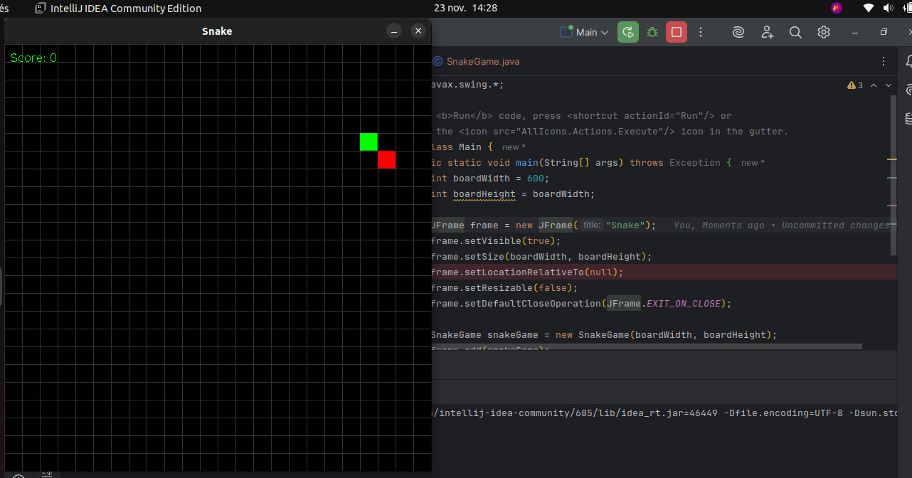

# 🐍 Snake - Le Classique d'Arcade en Java

## Description du Projet

Ce projet est une réimplémentation du jeu d'arcade classique "Snake" (Serpent), développé en Java.

Les éléments clés de cette version incluent :
* Le déplacement du serpent contrôlé par le joueur.
* La gestion de la croissance du serpent après avoir mangé la nourriture.
* La détection des collisions avec les murs et avec son propre corps.
* Un système de score pour suivre la progression.

## Aperçu du Jeu

Voici une capture d'écran de l'interface du jeu :

## 🛠️ Réalisé par

Ce projet a été développé par **Mariem Mhadhbi**.
