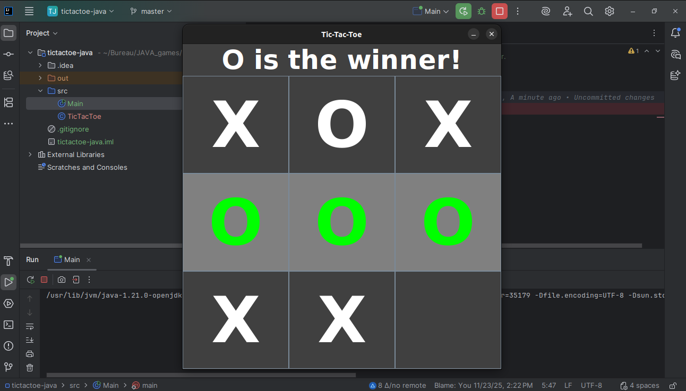

# ❌🅾️ Tic-Tac-Toe (Morpion) - Jeu de Stratégie en Java

## Description du Projet

Ce projet est une implémentation du jeu de stratégie classique "**Tic-Tac-Toe**" (Morpion) pour deux joueurs, développé en Java.

Les éléments clés de cette version incluent :
* La gestion de la **grille 3x3**.
* Le changement de tour entre les joueurs (**X** et **O**).
* La logique de détection de **victoire** (alignement de trois symboles).
* La gestion des matchs nuls.

## Aperçu du Jeu

Voici une capture d'écran de l'interface du jeu :

## 🛠️ Réalisé par

Ce projet a été développé par **Mariem Mhadhbi**.
