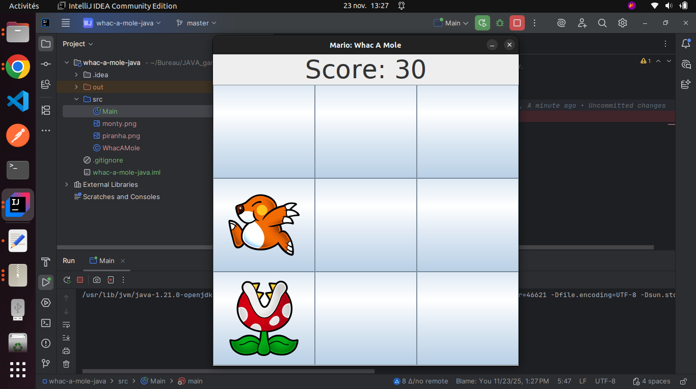

# 🔨 Whac-A-Mole - Jeu d'Adresse en Java

## Description du Projet

Ce projet est une implémentation du jeu d'arcade classique "Whac-A-Mole" (Tape-taupe), développé en Java.

Les éléments clés de cette version incluent :
* La génération aléatoire de taupes qui apparaissent et disparaissent.
* La gestion des clics de souris comme action de "tape".
* Le décompte du score et des tentatives (si applicable).
* Une limite de temps ou de vies.

## Aperçu du Jeu

Voici une capture d'écran de l'interface du jeu :

## 🛠️ Réalisé par

Ce projet a été développé par **Mariem Mhadhbi**.cxxxx
